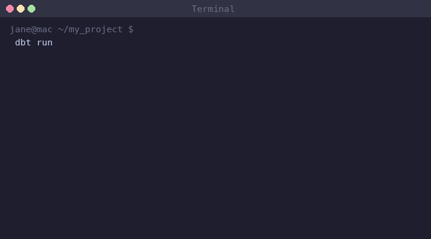

# 7. 데모

실제 dbt 명령어 실행 화면을 확인해보세요.

## dbt run

`dbt run`은 프로젝트의 모델들을 순서대로 실행합니다.

- 초록색: 성공한 모델
- 빨간색: 에러가 발생한 모델
- 마지막에 전체 결과 요약 (PASS / ERROR / SKIP)

!!! tip "에러 발생 시"
    에러가 발생하면 `target/run/` 폴더에서 실제 실행된 SQL을 확인하고,
    `dbt --debug run --select 모델명`으로 상세 로그를 볼 수 있습니다.
